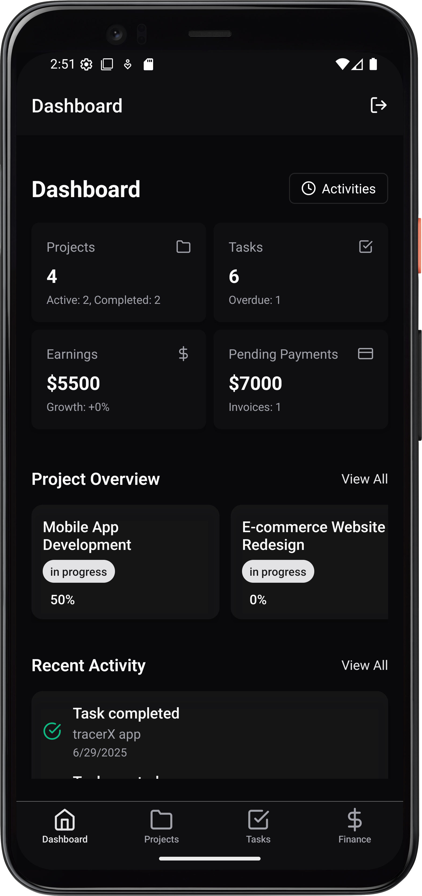
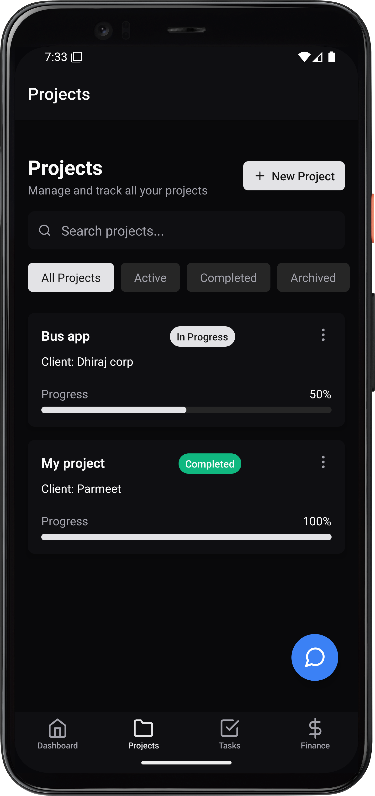
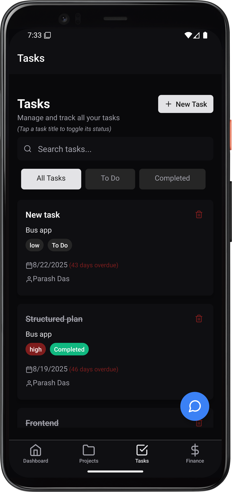
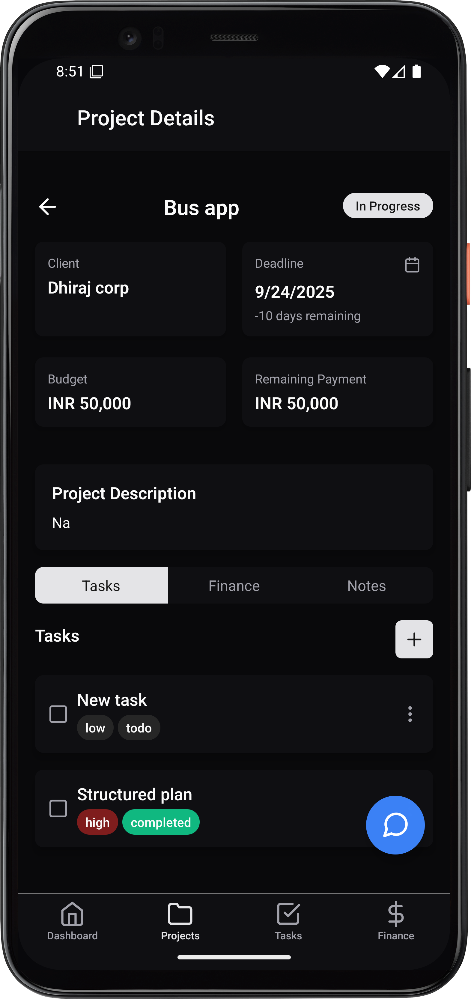
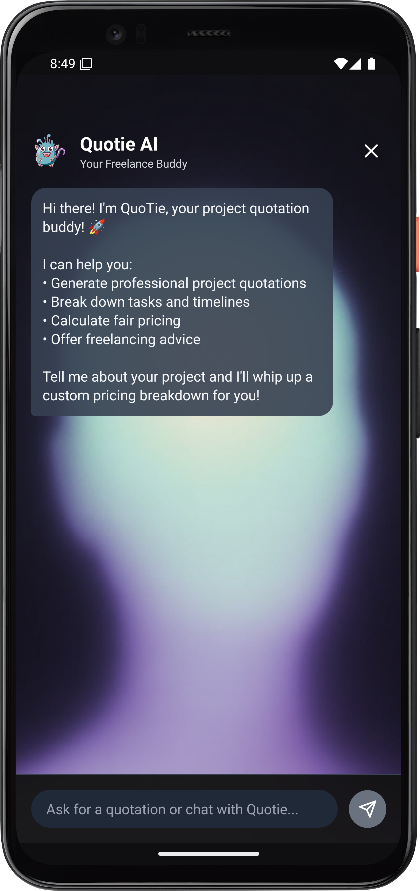

# TracerX

TracerX is a mobile application designed for freelancers and small teams to manage their projects, tasks, and finances efficiently. It provides a clear overview of your work, tracks your progress, and helps you stay on top of your earnings.

## ✨ Features

*   **Dashboard:** A comprehensive overview of your projects, tasks, and financial status at a glance.
*   **Project Management:** Create and manage projects, track their progress, and view associated tasks and financial details.
*   **Task Tracking:** Add, assign, and monitor tasks within your projects.
*   **Finance Overview:** Keep track of your earnings, pending payments, and invoices.
*   **AI Assistant:** An integrated chatbot, "QuoTie AI," to help you with project quotations and to act as a supportive buddy.

## 📸 Screenshots

| Dashboard | Projects |
| :---: | :---: |
| *Dashboard overview of projects, tasks, and finances.* | *List of all projects with their status and progress.* |
|  |  |

| Task Management | Project Details |
| :---: | :---: |
| *Manage and track all your tasks.* | *Detailed view of a project including budget, deadline, and tasks.* |
|  |  |

| Login | Chatbot |
| :---: | :---: |
| *Secure authentication screen.* | *AI-powered chatbot for assistance.* |
|  |  |


## 🚀 Getting Started

### Prerequisites

- Node.js
- npm or yarn
- Expo Go app on your mobile device

### Installation & Setup

1.  **Clone the repository:**
    ```bash
    git clone <your-repository-url>
    cd tracer-frontend
    ```

2.  **Install dependencies:**
    ```bash
    npm install
    ```

3.  **Set up environment variables:**
    Create a `.env` file in the root of the project and add your backend API URL:
    ```
    API_BASE_URL=http://<your-backend-api-url>
    ```

4.  **Start the development server:**
    ```bash
    npm start
    ```

5.  **Run on your device:**
    Scan the QR code from the terminal using the Expo Go app.
